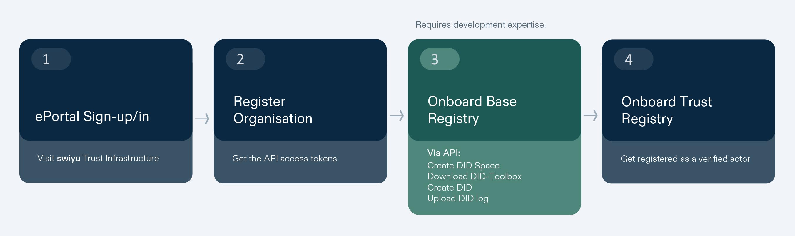
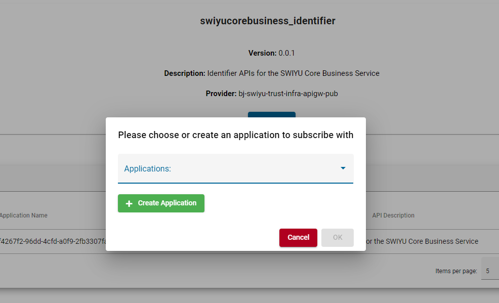
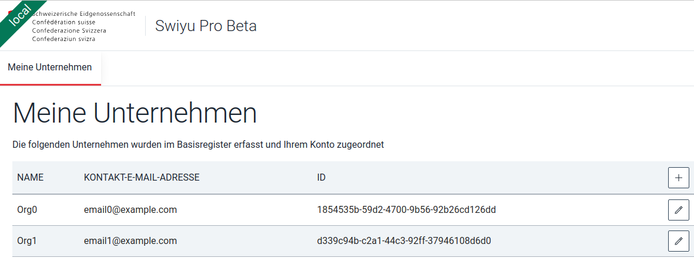
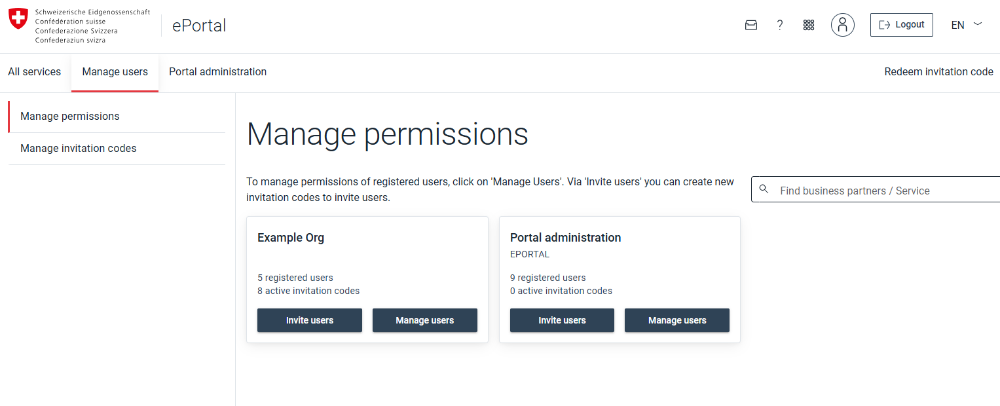
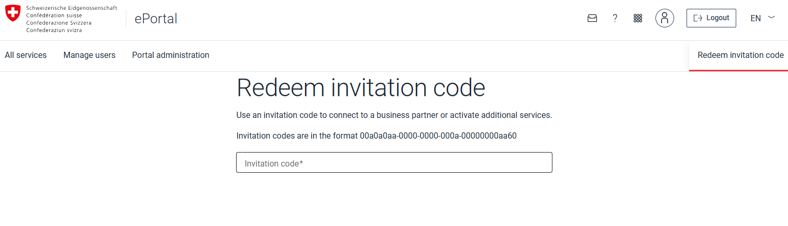

[](../assets/images/onboarding-steps3.jpg)
Before being able to act as an issuer or verifier in the swiyu ecosystem you will need to publish your public key material on the base registry and optionally metadata like a name and logo on the trust registry. Here you can find a step-by-step guide to get onboarded.

## Sign-in or up to ePortal

Login or sign up into ePortal via [AGOV](https://www.me.agov.admin.ch/registration?agovAq=100&source=idp) or CH-Login accounts in order to register to the Trust and Base regisrty

 [All services · ePortal](https://eportal.admin.ch/start)

## Open *swiyu* Trust Infrastructure

Search for the _swiyu Trust Infrastructure_ service and enter it.

[](../assets/images/welcome_to_eportal.png)

# Onboard on the swiyu Base Registry

## Business Partner registration

⚙️ The business partner id created here will be referenced as SWIYU\_PARTNER\_ID

To join an existing business partner, see: [Join an existing business partner](https://swiyu-admin-ch.github.io/cookbooks/onboarding-base-and-trust-registry/#join-an-existing-business-partner)

Register the business partner [^1] by providing a name [^2] and primary contact email.

[^1]: Under "business partner" is understood any type of company, private or public institution, but also individuals (natural persons) can register themselves as a business partner on the _**swiyu** Trust Infrastructure_ and use it.
[^2]: This name cannot be changed. To appear with another name, you will have to register a new business partner.


[](../assets/images/base_registry_enrollment.png)

## Get API keys to access swiyu APIs
--------------------------------------

Go to the API [self-service portal](http://selfservice.api.admin.ch/api-selfservice) to register for the ecosystem APIs.

If you are registered with multiple business partners, you can click the business partner ID on the top right in order to select with which one you want to subscribe. 

[](../assets/images/api_selfservice.png)

**swiyucorebusiness_identifier:** Use this API to update your public key material on the Base Registry.

**swiyucorebusiness_status:** Use this API to manage your [status list](https://swiyu-admin-ch.github.io/swiss-profile/#credential-status).

Subscribe with your business partner to both _swiyu Core Business Service_ APIs.

Select an API and press **Subscribe.** You will be prompted to create a new application or select an existing one.

[](../assets/images/create_select_application.png)

[](../assets/images/create_application.png)



<p> ⚙️ The output of the application creation will be referenced as SWIYU_STATUS_REGISTRY_CUSTOMER_KEY / SWIYU_STATUS_REGISTRY_CUSTOMER_SECRET / SWIYU_STATUS_REGISTRY_BOOTSTRAP_REFRESH_TOKEN / SWIYU_STATUS_REGISTRY_ACCESS_TOKEN </p>

Safely store your keys - this is the only time they are shown to you. It is possible to create new ones if necessary.  
The ACCESS_TOKEN expires after 24 hours and can be refreshed using the REFRESH_TOKEN. The REFRESH_TOKEN is valid for 168 hours. You can always create new tokens if you lose them or both expire.



<div class="notice--warning">
  <h4 class="no_toc">Important:</h4>
  {{ notice-text | markdownify }}
</div>

### Authenticate with OAuth2

Use the access token as bearer token ([RFC 6750](https://datatracker.ietf.org/doc/html/rfc6750)) when connecting to the subscribed authoring API.

If you want to create a new access token without manual UI interaction you can use the [OAuth refresh token flow for the issuer](https://keymanager-prd.api.admin.ch/keycloak/realms/APIGW) to get valid access tokens for API access.

### Base URLs

⚙️ The status authoring URL will be referenced as SWIYU_STATUS_REGISTRY_API_URL, the key manager as KEY_MANAGER.

Use the [Swagger Editor](https://editor.swagger.io/) for convenience.

| Environment | Identifier Authoring | Status Authoring | Key Manager |
| --- | --- | --- | --- |
| swiyu Public Beta | [identifier-reg-api.trust-infra.swiyu-int.admin.ch](https://identifier-reg-api.trust-infra.swiyu-int.admin.ch/) | [status-reg-api.trust-infra.swiyu-int.admin.ch](https://status-reg-api.trust-infra.swiyu-int.admin.ch/) | [keymanager-prd.api.admin.ch](https://keymanager-prd-intra.api.admin.ch) |

In the next step you will need your business partner ID. You can find it in the **swiyu Trust Infrastructure** dashboard.

[](../assets/images/swiyu_dashboard.png)

## Onboard business partner on the swiyu Base Registry

### Create DID space

In order to onboard on the swiyu Base Registry you will first need to reserve some space.

```bash
curl \
  -H "Authorization: Bearer $YOUR_AUTH_TOKEN" \
  -X POST "https://identifier-reg-api.trust-infra.swiyu-int.admin.ch/api/v1/identifier/business-entities/$YOUR_BUSINESS_ENTITY_ID/identifier-entries"
```

**API Response 201**
<pre>{<br/>&emsp;"id": "18fa7c77-9dd1-4e20-a147-fb1bec146085",<br />&emsp;"identifier_registry_url": "https://identifier-reg.trust-infra.swiyu-int.admin.ch/api/v1/did/18fa7c77-9dd1-4e20-a147-fb1bec146085/did.jsonl"<br>}</pre>


The identifier_registry_url is used in the next step when creating the DID log.

The id is required when uploading your DID log.

### create a DID (or create the DID log you need to continue)

A Decentralized Identifier (DID) is a globally unique identifier that allows individuals and entities to create and manage their own digital identities independently of centralized authorities. To actively participate in the swiyu ecosystem as an issuer or verifier, you must create at least one DID and upload the resulting DID log content to the base registry. New DIDs can be created using the [DID Toolbox](https://github.com/swiyu-admin-ch/didtoolbox-java), since it involves a set of steps that are error prone or need some time to get familiar with and one might end up with invalid DIDs.

We recommend creating separate DIDs for each role (e.g., separate DIDs for issuers and verifiers).

**Currently, the swiyu ecosystem supports the following DID method: did:webvh, version 0.3.**

#### Prerequisites (using the JAR file)

Before using the DID Toolbox, ensure your system meets the following requirements:

*   Java Runtime Environment (JRE) 21 or Higher: The DID Toolbox requires Java JRE version 21 or above. Verify that Java is installed on your machine.
*   Internet Connection: Required for downloading the tool.
*   Operating System: Compatible with major operating systems, including Windows, macOS, and Linux. Ensure your OS is up to date to avoid compatibility issues.
*   Sufficient Disk Space: Allocate enough disk space for the tool and the generated key materials. 100 MB should suffice, depending on the number of DIDs you intend to generate.

#### Downloading the DID Toolbox

The current release can be downloaded from the [repository](https://github.com/swiyu-admin-ch/didtoolbox-java/releases)

#### Quickstart – Create Your First DID

The Quickstart option is designed for users who want to rapidly set up one or multiple DIDs without getting too much into the DID method internals. This automates the generation of necessary asymmetric key pairs and generates the initial DID log content, which must be uploaded to the swiyu Base Registry later in the process (see Upload DID log).

###### Command Syntax

⚙️ The generated pem .didtoolbox/assert-key-01 fille will be referenced as "assert-key-01"

To run the DID Toolbox using the Quickstart option, use the following command structure:

**Command Samples**

```
# Parameter
java -jar didtoolbox.jar create --identifier-registry-url <identifier_registry_url>
 
# Example
java -jar didtoolbox.jar create --identifier-registry-url https://identifier-reg.trust-infra.swiyu-int.admin.ch/api/v1/did18fa7c77-9dd1-4e20-a147-fb1bec146085/did.jsonl
```

*   create: Command to create a new DID
*   <identifier_registry_url>: URL received as a result of DID space creation from step "Create DID space"

For advanced usage or detailed parameter descriptions, please refer to the [DID Toolbox repository](https://github.com/swiyu-admin-ch/didtoolbox-java#advanced-usage).

###### What Happens Upon Execution

*   Key Pair Generation: Three key pairs are created and stored in the .didtoolbox directory (output directory, will be created automatically) in PEM format  
    **Take good care of the generated key material. You will need it again later on (e.g. to configure it in your Issuers and/or Verifiers, see:** [Issuer-Management](https://github.com/swiyu-admin-ch/eidch-issuer-agent-management) & [Verifier-Management](https://github.com/swiyu-admin-ch/eidch-verifier-agent-management)
    *   DID Update Key Pair:
        *   id_ed25519: Private key (not password protected)
        *   id_ed25519.pem: Public key
    *   DID Authentication Key Pair:
        *   auth-key-01: Private key (not password protected)
        *   auth-key-01.pem: Public key
    *   DID Assertion Key Pair:
        *   assert-key-01: Private key (not password protected)
        *   assert-key-01.pem: Public key
*   DID Log Generation: A DID log line is generated and output to the standard console (stdout). You can redirect this output to a file if necessary. **This is the output you need to continue with the step "Upload DID log".**

###### DID Log Content

⚙️ The DID generated in this step will be referenced as ISSUER_DID or VERIFIER_DID

The generated DID log content should look similar as shown below. After creation, it consists of a single, albeit lengthy, line.

**DID log Sample**
```yaml
["1-Qmdc45SbY6miLmcw2EyAysLy2A99TeiQqVXkkyh6qzsLTm","2025-01-07T09:06:06Z",{"method":"did:tdw:0.3","scid":"QmU49w8drdPUk4g8NXsLqVRqLRz588N99tBSRRBLoxXHow","updateKeys":["z6Mkn9mdkU9YnexYS2fqMRkTrpJMBNx344KNb4cAgWFFVWQE"],"prerotation":false,"portable":false},{"value":{"@context":["https://www.w3.org/ns/did/v1","https://w3id.org/security/multikey/v1"],"id":"did:tdw:QmU49w8drdPUk4g8NXsLqVRqLRz588N99tBSRRBLoxXHow:identifier-reg.trust-infra.swiyu-int.admin.ch:api:v1:did:18fa7c77-9dd1-4e20-a147-fb1bec146085","authentication":["did:tdw:QmU49w8drdPUk4g8NXsLqVRqLRz588N99tBSRRBLoxXHow:identifier-reg.trust-infra.swiyu-int.admin.ch:api:v1:did:18fa7c77-9dd1-4e20-a147-fb1bec146085#auth-key-01"],"assertionMethod":["did:tdw:QmU49w8drdPUk4g8NXsLqVRqLRz588N99tBSRRBLoxXHow:identifier-reg.trust-infra.swiyu-int.admin.ch:api:v1:did:18fa7c77-9dd1-4e20-a147-fb1bec146085#assert-key-01"],"verificationMethod":[{"id":"did:tdw:QmU49w8drdPUk4g8NXsLqVRqLRz588N99tBSRRBLoxXHow:identifier-reg.trust-infra.swiyu-int.admin.ch:api:v1:did:18fa7c77-9dd1-4e20-a147-fb1bec146085#auth-key-01","controller":"did:tdw:QmU49w8drdPUk4g8NXsLqVRqLRz588N99tBSRRBLoxXHow:identifier-reg.trust-infra.swiyu-int.admin.ch:api:v1:did:18fa7c77-9dd1-4e20-a147-fb1bec146085","type":"JsonWebKey2020","publicKeyJwk":{"kty":"OKP","crv":"Ed25519","kid":"auth-key-01","x":"CyWSTgeCUzaD4lUWT07vMg-GsTWNOwnEFF7Rfu7OrWU"}},{"id":"did:tdw:QmU49w8drdPUk4g8NXsLqVRqLRz588N99tBSRRBLoxXHow:identifier-reg.trust-infra.swiyu-int.admin.ch:api:v1:did:18fa7c77-9dd1-4e20-a147-fb1bec146085#assert-key-01","controller":"did:tdw:QmU49w8drdPUk4g8NXsLqVRqLRz588N99tBSRRBLoxXHow:identifier-reg.trust-infra.swiyu-int.admin.ch:api:v1:did:18fa7c77-9dd1-4e20-a147-fb1bec146085","type":"JsonWebKey2020","publicKeyJwk":{"kty":"OKP","crv":"Ed25519","kid":"assert-key-01","x":"GTMNlEdWeP-AB40XXG19R57_TUOsgWY4kypRG4ZrQWQ"}}]}},{"type":"DataIntegrityProof","cryptosuite":"eddsa-jcs-2022","created":"2025-01-07T09:06:06Z","verificationMethod":"did:key:z6Mkn9mdkU9YnexYS2fqMRkTrpJMBNx344KNb4cAgWFFVWQE#z6Mkn9mdkU9YnexYS2fqMRkTrpJMBNx344KNb4cAgWFFVWQE","proofPurpose":"authentication","challenge":"1-Qmdc45SbY6miLmcw2EyAysLy2A99TeiQqVXkkyh6qzsLTm","proofValue":"z4GG3MaCgwTWH5hEi7C1DyAJzr3VFbfmT9s1PN5Pr4BxgvYSbYsgn5kYAgwxFwXrGC8Wdm45HScq72xkujvPcFhm9"}]
```

In the example above the DID is the following

**DID sample**

```yaml
did:tdw:QmU49w8drdPUk4g8NXsLqVRqLRz588N99tBSRRBLoxXHow:identifier-reg.trust-infra.swiyu-int.admin.ch:api:v1:did:18fa7c77-9dd1-4e20-a147-fb1bec146085
```

#### Additional Information

*   Output Directory: The .didtoolbox directory is automatically created in the current working directory. Ensure you have the necessary permissions to create and write to this directory.
*   Multiple DIDs: If you create multiple DIDs, please make sure to rename the .didtoolbox directory (or move/rename the files) after each creation run, since the key material will be re-generated on each run and therefore overwritten.
*   Security: Keep your private keys secure. Do not share them or expose them in unsecured environments.
*   Using Existing DIDs: While the Quickstart option generates new DIDs and key material, future versions of the DID Toolbox may support importing and managing existing DIDs. 

### Upload DID log

Use the Identifier API to upload your DID log.

```bash
curl \
  -H "Authorization: Bearer $YOUR_AUTH_TOKEN" \
  -H "Content-Type: application/jsonl+json" \
  -d "$YOUR_GENERATED_DIDLOG" \
  -X PUT "https://identifier-reg-api.trust-infra.swiyu-int.admin.ch/api/v1/identifier/business-entities/$YOUR_BUSINESS_ENTITY_ID/identifier-entries/$ID_FROM_PREVIOUS_STEP"
```

Add the DID log you created earlier as string body (not JSON).

Make sure the content-type is set to "application/jsonl+json"

Now you are registered on the swiyu Base Registry and be able to configure your issuer and verifier component.

### Use/Integrate the swiyu Trust Infrastructure

One way to interact with the swiyu ecosystem is to host either a swiyu Generic Issuer and/or a swiyu Generic Verifier or bring your own implementation. Instructions on how to setup the components can be found in the [swiyu Generic Issuer cookbook](https://swiyu-admin-ch.github.io/cookbooks/onboarding-generic-issuer/) and the [swiyu Generic Verifier cookbook](https://swiyu-admin-ch.github.io/cookbooks/onboarding-generic-verifier/).

### Initialize a status list (verifier only)
If you don't use the generic verifier you can use the status list API directly:

**Initialize a status list**
```bash
curl -X POST 'https://status-reg-api.trust-infra.swiyu.admin.ch/api/v1/status/business-entities/{businessEntityId}/status-list-entries/' \
  -H 'accept: application/json' \
  -H 'Authorization: Bearer your token' \
  -d ''
```
**Update status list**
```bash
curl -X PUT 'https://status-reg-api.trust-infra.swiyu.admin.ch/api/v1/status/business-entities/{businessEntityId}/status-list-entries/{statusRegistryEntryId}' \
  -H 'Content-Type: application/statuslist+jwt' \
  -d 'Status list content according to https://www.ietf.org/archive/id/draft-ietf-oauth-status-list-02.html#name-status-list-request'
```

### Become a trusted participant
To be acclaimed as a trusted issuer or verifier you need to additionally contact us by using the form found on the [swiyu Trust Infrastructure service](#open-swiyu-trust-infrastructure)

[](../assets/images/Cookbook_mail_trustregister.png)

### User management

#### Invite members to your business partner


Go to [e-portal](https://eportal.admin.ch/) and click on _manage users:_

[](../assets/images/invite_members.png)

Generate as many invitation codes as you need and make sure to add the appropriate roles.

[](../assets/images/create_codes.png)

#### Join an existing business partner

To Join an already existing business partner, press the _Redeem invitation code_ button on the top right.

[](../assets/images/redeem_code.png)