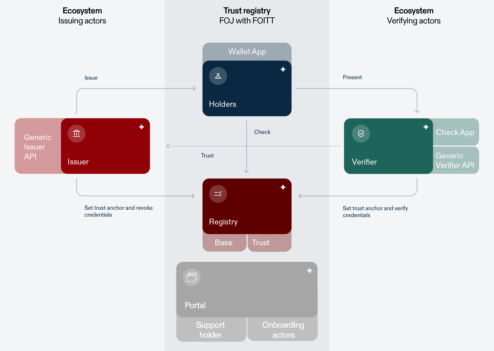
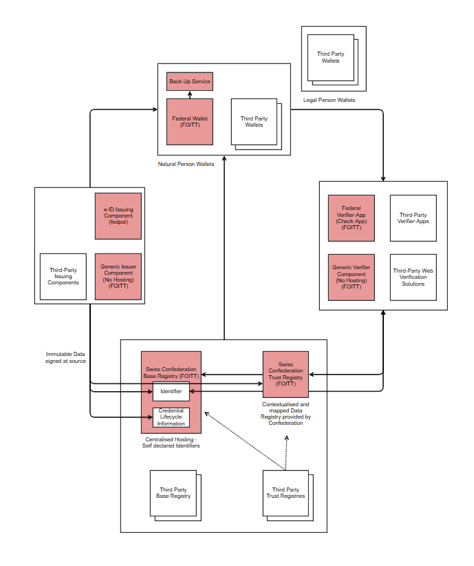

The swiyu Trust Infrastructure builds the backbone for the implementation of the BGEID (Bundesgesetz über den elektronischen Identitätsnachweis und andere elektronische Nachweise). Its main purpose is to lay a technical foundation that enables secure and trusted digital interactions between issuers, holders and verifiers of digital credentials, while giving users the control over which information they share with whom. User control is achieved by providing holders with digital credentials that can be managed through the swiyu wallet developed by the confederation as well as third party wallets. Data integrity and authenticity build the foundation of security and trusted interactions. This trust is established on a cryptographic and organizational level and implemented through the swiyu Base and Trust Registry. The following outlines the core elements of the BEGID ecosystem and the swiyu Trust Infrastructure. 

## Roles

### Holder & Wallets

Holders are at the centre of the ecosystem. They receive credentials from an issuer and can present these to a verifier whenever they want. When presenting a credential, holders generate a cryptographic proof that ensures presentations are time-bound and cannot be maliciously forwarded by the verifier or another entity. Holders can manage their credentials and generate cryptographic proofs with the help of a wallet application (hereafter referred to as “wallet”). 

The wallet can best be described as a secure, digital application (e.g., installed on a mobile device) that stores and manages digital credentials issued to individuals. This wallet is the primary interface through which individual holders (e.g. citizens and residents) interact with other participants. 

The wallet securely holds digital credentials, such as the e-ID credential. It also provides information about the [status of credentials](Link auf Credential Lifecycle) (e.g., whether the credential is valid or had been revoked) and will allow holders to view their personal usage history of the wallet. In interactions with verifiers, it provides holders control over their data disclosure, by letting them decide which credentials or content thereof to share. Using techniques for [user authentication](Link) and [device binding](Link), the wallet ensures that only the user can access and share the stored credentials.    

In essence, the wallet is a crucial element in the swiyu Trust Infrastructure, as it enables user autonomy and decentralization. By design, credentials are stored in a decentral manner solely on a user’s device, reducing risks of mass data breaches and preventing tracking of usage by a centralised body. The Confederation provides users with a Wallet (swiyu) which allows them to request, hold and present credentials in an easy and privacy preserving manner.  

### Issuer

Issuers are entities responsible for creating and issuing digital credentials to the wallets of holders. These credentials are designed to certify specific information about or otherwise associated with the holder, such as their identity, data relating to their person, qualifications or simply event tickets. 

The Issuer independently decides, what information is contained in a credential. To certify this information the issuer cryptographically signs the credential, ensuring that it is tamper proof and remains verifiable. Issuers are responsible for the lifecycle management of credentials they provide. Hence, they take care of revoking, suspending, or re-issuing credentials, when necessary. Thus, they ensure the integrity and reliability of issued credentials. 

Every entity from the private or public sector could be an issuer using the swiyu Trust Infrastructure if they fulfil the technical and the general requirements for the onboarding. They can then issue credentials to a wallet. During the issuing process, they may further prove that they are a verified identity and/or legitimate issuer if they are registered as such in the Trust Registry (see below). 

### Verifier

Verifiers are entities that validate the credentials presented by holders to prove specific information. Verifiers confirm the integrity, authenticity and validity of credentials by checking the cryptographic signatures associated with the proof, both from the issuers and the holder wallet. They can also check the status of credentials to evaluate whether the presented credentials are still acceptable.  

Another primary role of verifiers is to interpret the content of the credentials. The required content and interpretations to achieve this is defined by the context and services of a verifier and the user data that is necessary to provide the service or to fulfil the specific context. 

### Registries

The registry is the entity that provides information about the identity of issuers and verifiers and data to verify the validity of credentials. The aforementioned information is publicly available. In the swyiu Trust Infrastructure two different registries are provided by the Swiss Confederation: The Base Registry and the Trust Registry. 

#### Base Registry

The Base Registry serves as a publicly available registry of technical identifiers that represent entities using the infrastructure as issuers or verifiers. This can for example be legal entities, government agencies, or individuals. It provides cryptographic methods to register, update and verify identifiers, in the form of decentralized identifiers (DIDs) possessed by these entities.  

Every DID has cryptographic key material associated with it that is used to establish secure connections, sign credentials or verify that a credential originates from a registered issuer and was not altered after issuance. The key material is retrieved via the corresponding DID of the issuer or verifier that is registered on the Base Registry and resolves to a DID Document (also stored on the Base Registry). Hence, the Base Registry only contains DIDs together with the associated DID Documents and no information on whether a DID is used to represent an issuer or a verifier. In the case of the swiyu Trust Infrastructure, the Base Registry is operated centrally by the Swiss Confederation. Integrity of the data provided on the registry is assured by relying on publishing data signed at the source of creation. 

In addition, the Base Registry enables issuers to maintain life-cycle information of verifiable credentials that states if a credential is valid or has been revoked or suspended. By doing this it supports secure and reliable verification of electronic credentials and provides information on their validity status in a privacy-preserving manner. The design ensures that any status information cannot reveal details about the respective credential’s holder or content. 

In summary, the Base Registry provides means for secure and efficient verification and issuance which is essential for gaining and maintaining trust in the swiyu Trust Infrastructure. It is implemented by the Federal Office of Information Technology and Telecommunications (FOITT), containing only the data necessary for the legal purposes defined in Art. 2 (LINK). 

#### Trust Registry

The Trust Registry provides trust through implementing human-readable measures to support decisions about whether users want to trust actors they interact with or the information they receive. This complements the cryptographic trust provided by the Base Registry.  

To support trust, the Trust Registry confirms the mapping between an identifier (DID) that is registered on the Base Registry and the name of the entity as it is known in the physical world (for example, the name listed in the commercial register or stated in a passport). The connection between the DID and the entity it represents is validated by the FOJ. After successful validation, a signed trust statement is published on the trust registry and issued in the form of a verifiable credential containing the DID and the associated entity name. 

The mechanisms of the base registry will be used to provide information about the status of the trust statements. Hence the status information will be stored separately to the trust statement itself, guaranteeing privacy during trust statement validation. 

## Components and governance

The Confederation is developing various components to support issuers, holders and verifiers in their management and exchange of the e-ID and other credentials. The following provides a vision of the future swiyu ecosystem and the Trust Infrastructure. It details the components that are or will be developed by the Confederation, where these are hosted, how these interlink with one another and how third-party components can interact with the swiyu Trust Infrastructure.  

### Role-specific components provided by the Confederation

#### swiyu

Swiyu is the mobile wallet app provided by the Confederation. Swiyu allows users to securely receive and manage their e-ID and other digital credentials as well as share these with a verifier via the web or in-person. In addition, the wallet retrieves and displays trust information (from the swiyu Base and Trust Registry). The swiyu wallet is developed by the FOITT as an open-source component (LINK:opensource). In the future, the Confederation might extend the wallet with a [Backup Service](Link auf Roadmap) allowing holders to store backups on a state-provided infrastructure. 
 
#### e-ID Issuing Component

The e-ID issuing component is a specialized issuer system operated and used by fedpol. It is tailored to the specific infrastructure and processes required for issuing Swiss e-IDs. The e-ID issuing component can issue e-IDs into the swiyu wallet. As an issuer the fedpol uses the the swiyu Base and Trust registry to provide information on the DIDs used for issuing e-IDs and the e-ID’s validity status. Issuing Swiss e-IDs to third-party wallets will be possible in the future, given that these wallets fulfil defined requirements. 

#### swiyu Generic Issuer

The swiyu Generic Issuer is a reference implementation that bundles core functionalities required for issuing and managing the lifecycle of digital credentials. It is provided [Open Source]( https://swiyu-admin-ch.github.io/open-source-components/#swiyu-generic-issuer) by the FOITT but needs to be operated individually. Any issuer can make use of and tailor this reference implementation to specific needs for issuing digital credentials. By default, it will be interoperable with the swiyu wallet, the swiyu Base Registry and the swiyu Trust Registry. Interoperability with third-party components will be possible, if these are conformant to the [specifications](Link auf specs) of the swiyu Trust Infrastructure and/or specifically integrated by the issuers themselves.  

#### swiyu Check

The swiyu Check App is the official mobile verifier application that will be provided by the FOITT. The App can be used to verify Swiss e-IDs in a face-to-face situation. The App can be used for verifying credentials that are stored in the swiyu wallet as well as  third-party wallets that are interoperable with the swiyu Trust Infrastructure. In the future, the Check App may also be able to verify credentials other than the e-ID. 

#### swiyu Generic Verifier

The swiyu Generic Verifier is a reference implementation that bundles core functionalities required for verifying the e-ID and other digital credentials over the internet. Its components are provided open source by FOITT (LINK:opensource) but need to be operated individually. Any verifier can integrate and adapt this reference implementation to their business needs. By default, it will be interoperable with the swiyu Trust Infrastructure (i.e., swiyu wallet, swiyu Base Registry and swiyu Trust Registry). Interoperability with third-party components may be possible, if these are conformant to the specifications of the swiyu Trust Infrastructure and/or specifically integrated by the issuers themselves.  

#### swiyu Base Registry

The swiyu Base Registry is a public registry hosted by the FOITT. It holds identifiers and the respective public keys of issuers and verifiers, as well as the revocation status lists of the e-ID and other digital credentials. Any entity can [on- and offboard]( Onboarding the swiyu Base & Trust Registry - swiyu technical documentation) from the registry as an issuer or verifier. For integration with other components, the source code of the swiyu Base Registry is openly available (LINK: https://swiyu-admin-ch.github.io/open-source-components/#swiyu-base-registry). 

#### swiyu Trust Registry

The swiyu Trust Registry is a public registry hosted by FOITT. It holds trust statements that verify identifiers and provide a mapping to the real-world name of their subjects. The swiyu Trust Registry will only refer to identifiers that are published in the swiyu Base Registry. In addition, it can hold trust statements that certify legitimate issuers and verifiers for specific [credential schemas]. These trust statements are additionally issued in the form of a VC to their holders. The entries of identity trust statements are managed by the FOJ, who verifies the linkage between actor and identifier. The FOJ will also manage issuer and verifier trust statements for entities fulfilling regulated functions. In consequence, any entity aiming to be certified with a trust statement must publish their identifier in the swiyu Base Registry. For integration with other components, the source code of the swiyu Trust Registry is openly available (LINK: https://swiyu-admin-ch.github.io/open-source-components/#swiyu-trust-registry). 

#### DID Toolbox & Resolver

Besides these role-specific components, FOITT is also developing complementary tooling for managing DIDs that can be of help for multiple roles. The currently provided and supported general open-source tooling covers a DID Toolbox and a DID resolver that can be accessed here: (https://swiyu-admin-ch.github.io/open-source-components/#did-toolbox). 

### Third-party Components

The Swiss Confederation does not exclude the development of third-party components that interact with the swiyu Trust Infrastructure. In general, entities are free to develop proprietary and open-source components and distribute them in the Swiss market. While doing so, adhering to [the specifications] set by the Confederation is highly recommended to ensure full interoperability with the Trust Infrastructure.  

For certain use cases and services, additional restrictions may apply. For instance, third-party registries may not automatically be integrated within the swiyu wallet, Check App, and other components. On the other hand, certain complementary services provided by the Confederation may only be accessible with the respective swiyu components, such as the swiyu Backup Service. 

## Credential Lifecycle

A credential lifecycle refers to the series of stages that a digital credential undergoes, from its initial definition all the way to its invalidation or replacement. It typically starts with defining the credential’s structure (schema), personalizing it for an individual holder, continued by issuing it and securely binding it to that holder. Once issued, the holder receives control over the credential and can freely handle its presentation. The lifecycle also includes the stages of suspension or revocation of a credential if it’s compromised or no longer valid. It allows for renewal of the credential to ensure continued accuracy and trustworthiness. 

| insert table here |

# Trust

The swiyu Trust Infrastructure supports the development of trust between interacting parties by different means (e.g., by ensuring each issuer and verifier can be correctly identified and authorized within the registries). The following means are provided. 

## User Story 1: As an issuer, I want to trust the wallet I interact with. 

Issuers want to trust that the wallets they interact with adhere to protocol standards and are capable of securely handling and verifying issued credentials. In the swiyu Trust Infrastructure, this trust is enabled by cryptographic verification of the wallet (app or key attestation). The publication of the source code is an additional trust-building factor, as the functionality of the wallet can be verified. One example for such a wallet is the federally provided swiyu wallet.  

## User Story 2: As a verifier, I want to trust the issuer 

Verifiers want to trust the issuers of the credentials they request. Utilizing the information retrieved via the swiyu Base Registry (i.e., DID documents) and the swiyu Trust Registry (e.g., identity verification and legitimate issuer information), verifiers can independently assess whether the issuer is reliable to issue the credential(s) in question. Trust in the registries is further reinforced through the registry onboarding processes, that establish an initial quality gate for parties to enter the swiyu Trust Infrastructure. 

## User Story 3: As a holder, I want to trust the issuer 

Holders assess the trustworthiness of issuers based on the accuracy of their entry in the swiyu Trust Registry (e.g., identity verification and legitimate issuer information) and their own assessment of whether the issuer can be trusted to issue the credential under consideration. Trust is further strengthened by the swiyu Trust Registry onboarding processes and the non-compliance list that reports entities not complying to the legal framework. 

## User Story 4: As a holder I want to trust the verifier 

Holders assess the trustworthiness of verifiers based on the accuracy of their entry in the swiyu Base and Trust Registry (e.g., identity verification and legitimate verifier information) and their own assessment of whether the verifier is a trustworthy party that respect holder’s privacy and handles presented credentials appropriately. Trust is further strengthened by the swiyu Trust Registry onboarding processes and the non-compliance list that reports entities not complying to the legal framework and the rules of the Trust Infrastructure. 
