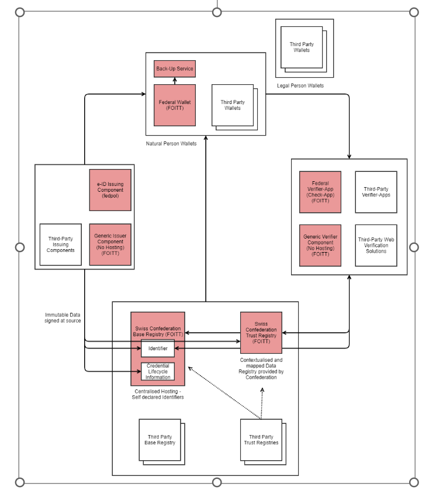

## Components of the trust infrastructure provided by the confederation

### Federal generic issuer component

Reference implementation that bundles core issuing functionalities and can be used and tailored to specific needs by any issuer.

In our cookbooks you'll find a step-by-step instruction on [how to get started as a Generic Issuer](https://swiyu-admin-ch.github.io/cookbooks/onboarding-generic-issuer/). If you're interested in more technical details and the Open Source Code, please visit the issuer agent repository

### Federal swiyu wallet

Holder wallet solution that bundles all features for users (= natural persons) to securely manage their e-ID and other VCs. It is provied by the Swiss Confederation and compliant to the Swiss trust infrastructure. 

[Link auf Android wallet repository](https://github.com/e-id-admin/eidch-android-wallet)
[Link auf Android Play Store]()

[Link auf iOS wallet repository](https://github.com/e-id-admin/eidch-ios-wallet)
[Link auf Apple App Store]()

### Federal generic verifier component

Reference implementation that bundles core functionalities for web verification and can be used and tailored to specific needs by any verifier. 

In our cookbooks you'll find a step-by-step instruction on [how to get started as a Generic Verifier](https://swiyu-admin-ch.github.io/cookbooks/onboarding-generic-verifier/). If you're interested in more technical details and the Open Source Code, please visit the verifier agent repository

### Swiss confederation base registry

Registry hosted by the Swiss Confederation that holds decentralized digital identitifers and revocation status lists. 

-> Link auf Repos

### Swiss confederation trust registry

Registry hosted by the Swiss Confederation that holds trust statements about identity, issuance, and verification. 

-> Link auf Repos

## Requirements for providing 3rd party components
