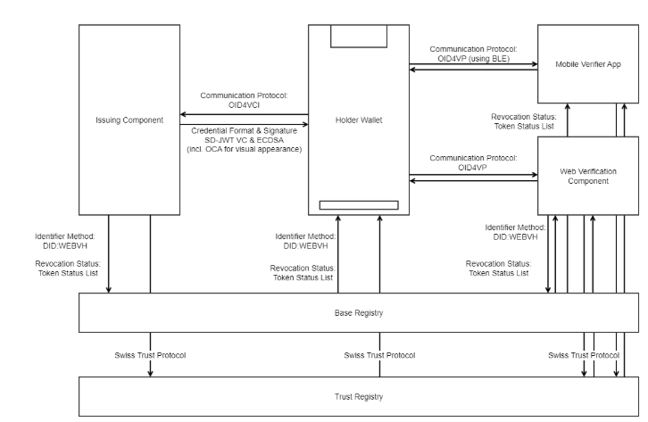

An initial selection which technology will be utilized for the issuance of the e-ID and underlying trust infrastructure has been made. A more detailed explanation regarding this choice can be found here: [Initial Technology](https://github.com/e-id-admin/open-source-community/blob/main/tech-roadmap/initial-technology.md) 

The e-ID Program strives to provide a transparent insight into the current working hypothesis for issuance of the e-ID and the underlying trust infrastructure. 
As mentioned in [Initial Technology](https://github.com/e-id-admin/open-source-community/blob/main/tech-roadmap/initial-technology.md), the FDJP aims to provide a architecture, that in the long term, has the ability to support multiple standards and will allow ecosystem participants to decide what capability or format should be prioritized for their use case. The future evolution regarding multi-stack capabilities will also be published in this document.

The following table provides a reference that indicates which standards are currently in selection for the Swiss trust infrastructure. It is a working hypothesis that will be updated if perspectives within the implementing organizations change. We invite interested parties to “star” the repository to receive automatic updates in case this document undergoes changes. 
We currently differentiate between support for [Public-Beta](https://www.eid.admin.ch/en/public-beta-e) and the initial go live support.

The domain of digital identities is developing at a rapid pace. While the Confederation aims to provide a degree of assurance and stability for integrators even at this early stage, evolution seems inevitable. Changes will be considered, especially if they benefit privacy-protection for users, increase the security and stability of the overall system, or if standards converge to serve the purpose of fostering interoperability.

## Selected base technologies and supported technical standards

| Aspect      | Current Hypothesis   | Public Beta Support   | Initial Go Live Support |  
| ----------- | ----------- |----------- |----------- |
| **Identifiers**       | Decentralized Identifiers (**DIDs**) v1.0 according to [W3C](https://www.w3.org/TR/did-core/)   DID Method: **[did:tdw/did:webvh](https://identity.foundation/trustdidweb/)**     | **SELECTED**   Hosted on central base registry provided by Confederation | **CANDIDATE** Final decision for productive system pending |
| **Status Mechanisms**       | [Statuslist](https://datatracker.ietf.org/doc/draft-ietf-oauth-status-list/) | **SELECTED** | **HIGH** |
| **Trust Protocol**       | [Trust protocol based on VCs](https://github.com/e-id-admin/open-source-community/blob/main/tech-roadmap/rfcs/trust-protocol/trust-protocol.md)  | **SELECTED**   Initial support of the "identity" trust statement by Confederation | **HIGH**   Additional support of issuer & verifier legitimacy (per VC schema) |
| **Communication Protocol (Issuance/Verification)**       | OID4VC/OID4VP   [Issuance](https://openid.net/specs/openid-4-verifiable-credential-issuance-1_0-ID1.html)   [Verification](https://openid.net/specs/openid-4-verifiable-presentations-1_0-ID2.html)  | **SELECTED**   In accordance with [Swiss profile](https://github.com/admin-ch-ssi/specifications-to-publish/blob/main/swiss_profile.md) | **HIGH** |
| **Payload Encryption**       | [JWE](https://www.rfc-editor.org/rfc/rfc7516.html) as proposed by the communication protocol  | **CANDIDATE** | **CANDIDATE** |
| **VC-Format/Signature-Scheme Combination**       | [SD-JWT VC](https://datatracker.ietf.org/doc/draft-ietf-oauth-sd-jwt-vc/) & ECDSA   | **SELECTED**   In accordance with [Swiss profile](https://github.com/e-id-admin/open-source-community/blob/main/tech-roadmap/swiss-profile.md) | **HIGH** |
| **Device Binding Scheme**       | **Hardware** based device binding depending on capabilities provided by [Apple](https://developer.apple.com/documentation/cryptokit/secureenclave) or [Android](https://source.android.com/docs/security/features/keystore) mobile devices   **Software** based device binding implemented by wallets  |  Hardware  **SELECTED**   Software **UNSUPPORTED**  | Hardware **HIGH**   Software **HIGH** |
| **VC appearance**       | Visualization of Verifiable Credential with [OCA](https://github.com/e-id-admin/open-source-community/blob/main/tech-roadmap/rfcs/oca/spec.md) | **UNSUPPORTED** | **HIGH**|

*Versions of the referenced specs may change.*

**Probability interpretation:**  
- **UNSUPPORTED** = No Solution provided,  
- **OPEN** = Options are being assessed,  
- **CANDIDATE** = Standard/Spec is in selection,  
- **HIGH** = Current hypothesis for implementation,  
- **SELECTED** = Chosen for system,

### Issuer and Verifier Identification Method  

The Confederation intends to implement the proposed “Identifiers” in the e-ID Act (https://www.fedlex.admin.ch/eli/fga/2023/2843/de) as decentralized identifiers according to the W3C specification. 

For the Public Beta system the DID Method **did:tdw** has been chosen. It benefits from similar simplicity to did:web while adding additional security properties, in particular data integrity, which helps to operate a trustworthy ecosystem. This version of the specification refers to the OLD name for the [DID Method V0.3](https://identity.foundation/didwebvh/v0.3/). The DID Method name has since changed to **did:webvh** (“did:web + Verifiable History”).

Given the centralized role of the base registry in the Swiss trust infrastructures a solution is necessary that makes it impossible for the central instance to change the DID document of an ecosystem participant and therefore ensures trustworthiness in the data provided. In addition, the integrity of the DID document is verifiable on the client side. 

Before the final decision regarding the productive DID Method is be taken, additional clarifications are necessary.

**Considerations for the technology choice** 

To represent an entity as an issuer or verifier in the e-ID ecosystem, the Trust Infrastructure supports a specific implementation of the W3C DID standards called DID Method, which uses a DID ("Decentralized Identifier") as an identifier. The decision for using a DID as identifier was made based on the following evaluation criteria (the order of the criteria is random):  
- Persistence 
- Resolvability (built in) 
- Cryptographically verifiable (built in) 
- Control (subject-based) 
- Metadata 
- Global uniqueness 
- Human Meaningful 

**Lorem ipsum did:webvh**

The following table provides a reference that indicates which standards are currently in selection for the Swiss trust infrastructure. It is a working hypothesis that will be updated if perspectives within the implementing organizations change. We invite interested parties to “star” the repository to receive automatic updates in case this document undergoes changes. The following table provides a reference that indicates which standards are currently in selection for the Swiss trust infrastructure. It is a working hypothesis that will be updated if perspectives within the implementing organizations change. We invite interested parties to “star” the repository to receive automatic updates in case this document undergoes changes. The following table provides a reference that indicates which standards are currently in selection for the Swiss trust infrastructure. It is a working hypothesis that will be updated if perspectives within the implementing organizations change. We invite interested parties to “star” the repository to receive automatic updates in case this document undergoes changes.
- Persistence 
- Resolvability (built in) 
- Cryptographically verifiable (built in) 
- Control (subject-based) 
- Metadata 
- Global uniqueness 
- Human Meaningful 

**Security Considerations for the DID method**

1. Persistence 
2. Resolvability (built in) 
3. Cryptographically verifiable (built in) 
4. Control (subject-based) 
5. Metadata 
6. Global uniqueness 

### Verifiable Credentials - SD-JWT-VC  

#### Data Model
**Token Status Lists** will be prioritized because they consist a simple, lightweight and scalable approach to support revocation. Potential observability and unlinkability concerns associated with Status Lists can partially be mitigated by the architecture of the Swiss trust infrastructure.

**Considerations for the technology choice**

Potential observability and unlinkability concerns associated with Status Lists can partially be mitigated by the architecture of the Swiss trust infrastructure.
Given the central storage of revocation lists (on a system provided by the Confederation), issuers will not be able to monitor the activity related to a specific VC. The Confederation on the other hand will only know, which status list was accessed, without gaining information about the individual status checked within the list. 

**Security Considerations for the data model**

Regarding unlinkability: once a verifier knows the index within a specific status list, they gain a point to potentially correlate and monitor the status of the credential. This topic can be mitigated, for example with batch issuance of ephemeral credentials. For certain use cases the capability to monitor the status of a VC could be deemed a useful capability.

**Privacy Considerations for the data model**

Regarding unlinkability: once a verifier knows the index within a specific status list, they gain a point to potentially correlate and monitor the status of the credential. This topic can be mitigated, for example with batch issuance of ephemeral credentials. For certain use cases the capability to monitor the status of a VC could be deemed a useful capability.

#### Credential Format

Potential observability and unlinkability concerns associated with Status Lists can partially be mitigated by the architecture of the Swiss trust infrastructure.
Given the central storage of revocation lists (on a system provided by the Confederation), issuers will not be able to monitor the activity related to a specific VC. 

**Security Considerations for the credential format**

Potential observability and unlinkability concerns associated with Status Lists can partially be mitigated by the architecture of the Swiss trust infrastructure.
Given the central storage of revocation lists (on a system provided by the Confederation), issuers will not be able to monitor the activity related to a specific VC. The Confederation on the other hand will only know, which status list was accessed, without gaining information about the individual status checked within the list. 

**Privacy Considerations for the credential format**

Regarding unlinkability: once a verifier knows the index within a specific status list, they gain a point to potentially correlate and monitor the status of the credential. This topic can be mitigated, for example with batch issuance of ephemeral credentials. For certain use cases the capability to monitor the status of a VC could be deemed a useful capability.

#### Credential Storage 

**Considerations for the technology choice**

The primary requirements regarding the trust registry are stipulated by the proposed e-ID Act and primarily consist of the information to be provided:

- verification of the identity provided by the issuers and verifiers (e.g., actor who claims to be fedpol actually is fedpol);
- information related to the secure usage of verifiable credentials (e.g., fedpol is the only legitimate issuer of the e-ID credential); 

**Security Considerations for the credential storage**

After an evaluation of the previously published options (incl. OpenID Federation), it was decided to start with a specific Swiss implementation. This allows a minimal implementation reducing as much complexity as possible, is in line with the current timeline and can be a straight-forward implementation of the legal requirements.

#### Device Binding

The trust protocol could change in the future depending on technological adoption and maturity of other standards. 

**Considerations for the technology choice**

The primary requirements regarding the trust registry are stipulated by the proposed e-ID Act and primarily consist of the information to be provided:

- verification of the identity provided by the issuers and verifiers (e.g., actor who claims to be fedpol actually is fedpol);
- information related to the secure usage of verifiable credentials (e.g., fedpol is the only legitimate issuer of the e-ID credential); 

**Security Considerations for the credential device binding**

After an evaluation of the previously published options (incl. OpenID Federation), it was decided to start with a specific Swiss implementation. This allows a minimal implementation reducing as much complexity as possible, is in line with the current timeline and can be a straight-forward implementation of the legal requirements.

### Credential Exchange Protocols - OIDC4VDI/OID4VP

ipsum dolor sit amet, consectetur adipiscing elit, sed do eiusmod tempor incididunt ut labore et dolore magna aliqua. Ut enim ad minim veniam, quis nostrud exercitation ullamco laboris nisi ut aliquip ex ea commodo consequat. Duis aute irure dolor in reprehenderit in voluptate velit esse cillum dolore eu fugiat nulla pariatur. Excepteur sint occaecat cupidatat non proident, sunt in culpa qui officia deserunt mollit anim id est laborum
The trust protocol will be a independent specification published by the Confederation which uses signed SD-JWT VCs as containers to express trust statements about ecosystem actors.

**Considerations for the technology choice**

Potential observability and unlinkability concerns associated with Status Lists can partially be mitigated by the architecture of the Swiss trust infrastructure.
Given the central storage of revocation lists (on a system provided by the Confederation), issuers will not be able to monitor the activity related to a specific VC. The Confederation on the other hand will only know, which status list was accessed, without gaining information about the individual status checked within the list. 

**Security Considerations for the exchange protocols**

Regarding unlinkability: once a verifier knows the index within a specific status list, they gain a point to potentially correlate and monitor the status of the credential. This topic can be mitigated, for example with batch issuance of ephemeral credentials. For certain use cases the capability to monitor the status of a VC could be deemed a useful capability.

**Privacy Considerations for the exchange protocols**

Regarding unlinkability: once a verifier knows the index within a specific status list, they gain a point to potentially correlate and monitor the status of the credential. This topic can be mitigated, for example with batch issuance of ephemeral credentials. For certain use cases the capability to monitor the status of a VC could be deemed a useful capability.

### Transport Protocol - HTTPSVC-Format & Signature Scheme

**Considerations for the technology choice**

The primary requirements regarding the trust registry are stipulated by the proposed e-ID Act and primarily consist of the information to be provided:

- verification of the identity provided by the issuers and verifiers (e.g., actor who claims to be fedpol actually is fedpol);
- information related to the secure usage of verifiable credentials (e.g., fedpol is the only legitimate issuer of the e-ID credential); 

**Security and privacy Considerations for the transport protocol**

After an evaluation of the previously published options (incl. OpenID Federation), it was decided to start with a specific Swiss implementation. This allows a minimal implementation reducing as much complexity as possible, is in line with the current timeline and can be a straight-forward implementation of the legal requirements.

### Credential Revocation - Token Status List

**Considerations for the technology choice**

Potential observability and unlinkability concerns associated with Status Lists can partially be mitigated by the architecture of the Swiss trust infrastructure.
Given the central storage of revocation lists (on a system provided by the Confederation), issuers will not be able to monitor the activity related to a specific VC. The Confederation on the other hand will only know, which status list was accessed, without gaining information about the individual status checked within the list. 

**Security Considerations for the revocation mechanism**

Regarding unlinkability: once a verifier knows the index within a specific status list, they gain a point to potentially correlate and monitor the status of the credential. This topic can be mitigated, for example with batch issuance of ephemeral credentials. For certain use cases the capability to monitor the status of a VC could be deemed a useful capability.

**Privacy Considerations for the revocation mechanism**

Regarding unlinkability: once a verifier knows the index within a specific status list, they gain a point to potentially correlate and monitor the status of the credential. This topic can be mitigated, for example with batch issuance of ephemeral credentials. For certain use cases the capability to monitor the status of a VC could be deemed a useful capability.

### Cryptography & Key management

In order to be interoperable with other actors and to use a well-defined standard, the confederation intends to use **OID4VCI** (https://openid.net/specs/openid-4-verifiable-credential-issuance-1_0-ID1.html) and **OID4VP** (https://openid.net/specs/openid-4-verifiable-presentations-1_0-ID2.html) as communication protocols.

**Considerations for the technology choice**

Potential observability and unlinkability concerns associated with Status Lists can partially be mitigated by the architecture of the Swiss trust infrastructure.
Given the central storage of revocation lists (on a system provided by the Confederation), issuers will not be able to monitor the activity related to a specific VC. The Confederation on the other hand will only know, which status list was accessed, without gaining information about the individual status checked within the list. 

**Security Considerations for the crypto algorithm**

Regarding unlinkability: once a verifier knows the index within a specific status list, they gain a point to potentially correlate and monitor the status of the credential. This topic can be mitigated, for example with batch issuance of ephemeral credentials. For certain use cases the capability to monitor the status of a VC could be deemed a useful capability.

**Privacy Considerations for the crypto algorithm***

Regarding unlinkability: once a verifier knows the index within a specific status list, they gain a point to potentially correlate and monitor the status of the credential. This topic can be mitigated, for example with batch issuance of ephemeral credentials. For certain use cases the capability to monitor the status of a VC could be deemed a useful capability.

### Trust protocol

As OID4VC and OID4VP are the current hypothesis for the communication protocols, the hypothesis for the payload encryption is to be in line with these standards. Both define a way to do payload encryption.
This protects personally identifiable information between the Wallet and an Issuer or Verifier, even if the transport encryption is broken during a part of the transmission.

**Considerations for the trust management**

Potential observability and unlinkability concerns associated with Status Lists can partially be mitigated by the architecture of the Swiss trust infrastructure.
Given the central storage of revocation lists (on a system provided by the Confederation), issuers will not be able to monitor the activity related to a specific VC. The Confederation on the other hand will only know, which status list was accessed, without gaining information about the individual status checked within the list. 

**Security Considerations for the trust management**

Regarding unlinkability: once a verifier knows the index within a specific status list, they gain a point to potentially correlate and monitor the status of the credential. This topic can be mitigated, for example with batch issuance of ephemeral credentials. For certain use cases the capability to monitor the status of a VC could be deemed a useful capability.

**Privacy Considerations for the crypto algorithm**

Regarding unlinkability: once a verifier knows the index within a specific status list, they gain a point to potentially correlate and monitor the status of the credential. This topic can be mitigated, for example with batch issuance of ephemeral credentials. For certain use cases the capability to monitor the status of a VC could be deemed a useful capability.

