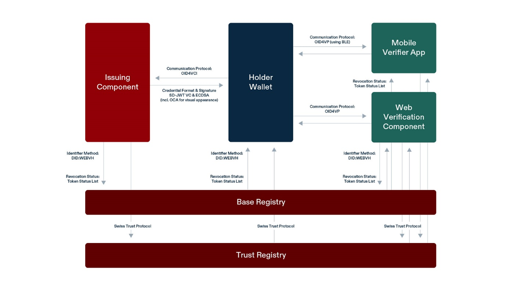

Multiple technical architectures, standards and approaches were considered in the development process of the swiyu Trust Infrastructure. A key decision was to follow the decentralized identity paradigm that is built around the subject as owner of their personal data. Technically, this paradigm is often implemented by providing data subjects with a digital identity wallet. In acknowledgement of the fast-paced technological ecosystem of identity wallet apps and digital credentials, the decision was made to work towards a multi-stack solution for the infrastructure. Meaning that, multiple technical specifications are going to be supported simultaneously by the swiyu Trust Infrastructure in the future. This approach allows Switzerland to benefit from technological advancements (e.g., privacy-enhancing features) as well as to ensure interoperability in cross-border use cases. 

Initially the Confederation will focus on a single technology stack to reduce complexity and ensure maximum technical interoperability within Switzerland. The technology decision that has been published on December 6th 2024 defines the current technology stack for the swiyu Trust Infrastructure. Its specifications are introduced below.

| Aspect |	Selected Technology & References to the version currently in use |
|-------|---------------|
| Identifiers |	[W3C Decentralized Identifiers v1.0](https://www.w3.org/TR/did-core/)   [did:tdw/did:webvh v0.3](https://identity.foundation/didwebvh/v0.3/) (as DID Method) |
| Status Mechanisms |	[Token Status List draft 3](https://www.ietf.org/archive/id/draft-ietf-oauth-status-list-03.html) |
| Trust Protocol |	[Swiss Trust Protocol version 0.1 (based on VCs)](https://swiyu-admin-ch.github.io/specifications/trust-protocol/) |
| Communication Protocol |	[OID4VCI – draft 13 (for credential issuance)](https://openid.net/specs/openid-4-verifiable-credential-issuance-1_0-ID1.html)   [OID4VP – draft 20 (for credential verification)](https://openid.net/specs/openid-4-verifiable-presentations-1_0-20.html) |
| Payload Encryption	| [JWE* (as proposed by the communication protocol)](https://www.rfc-editor.org/rfc/rfc7516.html) |
| VC-Format & Signature-Scheme |	[SD-JWT VC – draft 4](https://datatracker.ietf.org/doc/draft-ietf-oauth-sd-jwt-vc/04/)   [SD-JWT draft 10](https://datatracker.ietf.org/doc/draft-ietf-oauth-selective-disclosure-jwt/10/)   [ECDSA P-256](https://csrc.nist.gov/pubs/fips/186-5/final) |
| Device Binding Scheme	| Hardware-based device binding (depending on capabilities provided by [Android](https://source.android.com/docs/security/features/keystore) or [Apple](https://developer.apple.com/documentation/cryptokit/secureenclave) mobile devices)   Software-based device binding implemented by and wallets |
| VC appearance	 | [Overlays Capture Architecture](https://swiyu-admin-ch.github.io/specifications/oca/) (for visualization of VCs)

## Issuer and Verifier Identification Method – did:webvh

Decentralized Identifiers (DID) developed by the W3C represent an identifier standard that provides a subject-controlled method for identifying individuals, organizations, or objects online. In the swiyu Trust Infrastructure, DIDs are utilized as a standard identifier for issuers and verifiers. They are centrally hosted on the swiyu Base Registry.  

Each DID is a Universal Resource Identifier (URI) that is uniquely associated with a DID Document hosted on a globally accessible infrastructure. To make use of a DID, one must resolve the DID to its DID Document, where metadata like public keys and service endpoints for interactions based on the DID are stored.

To represent an entity as an issuer or verifier in the Trust Infrastructure, organizations are asked to use a specific implementation of the W3C DID standard a so-called DID Method. The DID Method selected for the swiyu Trust Infrastructure is “DID Web + Verifiable History” (did:webvh). 

DID:webvh was chosen as the DID Method for the swiyu Trust Infrastructure. Like the DID:web method, DID:webvh relies on a web-based infrastructure (HTTPS) making it easily deployable. DID:webvh (DID Web + Verifiable History) enhances DID:web by adding features, such as a verifiable history (while not relying on a ledger), update of key(s), and a self-certified identifier (SCID). As such, DID:webvh enables the verification of a DID’s entire history that is captured by the so-called DID Log. Furthermore, it ensures the authenticity and integrity of a DID by requiring a data integrity proof for every DID update. This proof is provided by signing the update with (one of) the update key(s) authorized to control the DID. This integrity ensures that no other entity (including the FOITT as the registry operator) can alter information in the DID Log and DID Doc, as they do not have control over the key(s) authorized to update the DID. In cases where a DID subject loses control of its active key(s), the concept of pre-rotation (i.e., providing a hash of the next public key in the DID document to commit to which key one will rotate next without exposing the public key itself) could allow to regain control of DID.

Within the swiyu Trust Infrastructure, some adaptations of the original did:webvh Method have been implemented. In essence, these are: 

- DID Portability (i.e., the capability to rename the DID string without distorting the SCID and DID history) will not be allowed to prevent duplicity of DIDs.
- References to additional DIDs (or other URIs) of the same DID subject captured under the “alsoknownas” property in the DID document will not be allowed. This restriction facilitates the implementation of a trust protocol and avoids references to other infrastructures whose trustworthiness cannot be assured by the Swiss Confederation.
- References to other endpoints via “services” will not be allowed for security reasons (e.g., protecting users from connecting to malevolent services).
- Pre-rotation will be allowed without support (i.e., the DID controller are responsible for managing this feature).
- Witnesses (i.e., entities that verify a DID document before its publication) will be allowed without support (i.e., the DID controller are responsible for managing this feature).
- DID Documents and DID Logs are centrally hosted on the swiyu Base Registry, where FOITT cannot alter entries in a DID Doc/Log but is able to delete these if needed (e.g., in the case of off boarding an entity from the trust infrastructure).

A more detailed, technical overview of the Swiss Profile for implementing DID:webvh in the swiyu Trust Infrastructure can be found [here](https://swiyu-admin-ch.github.io/specifications/interoperability-profile/).

The swiyu Trust Infrastructure provides the means to register, update and host a did:webvh supporting the creation of a DID (e.g., did:webvh:{SCID}:swiyu.ch) and storing of the corresponding DID Log, including the DID Docs, in the swiyu Base Registry.

## Verifiable Credentials – SD-JWT VC

Verifiable Credentials (VC) are cryptographically signed objects that encode identity statements about the respective data subject (typically the holder). They are issued by an issuer to a holder who controls the VC and can derive so-called verifiable presentations (VP) to demonstrate identity statements to a verifier. The contained cryptographic signatures ensure VCs are tamper-proof and their integrity and authenticity can be verified, without requiring direct communication between a verifier and the issuer. These properties enhance privacy and reduce attack surfaces for malicious actors. 

The swiyu Trust Infrastructure relies on verifiable credentials according to IETF SD-JWT VC currently in combination with the ECDSA signature scheme. SD-JWT VC is a context-independent standard for verifiable credentials. It is a modular format that can be used to issue various credential types, such as proof of residence or educational certifications. 

Technically, in SD-JWT VCs, each identity statement is encoded as a hash of the raw identity statement combined with a random nonce. All hashes and the credential metadata are signed with a cryptographic proof. The cryptographic proof ensures the disclosed data’s authenticity and integrity. This specific encoding also allows holders to selectively disclose claims from a credential while keeping others private yet ensuring the verifiability of data integrity and authenticity. Technically, each identity statement can then be proven by providing the verifier with the cryptographic material required for calculating the hash, the raw identity statement as well as its statement-specific nonce.

The [Swiss Profile](https://swiyu-admin-ch.github.io/specifications/interoperability-profile/) provides more detailed information on how to make use of SD-JWT VCs in the swiyu Trust Infrastructure. Essentially, it captures the claims that are relevant for providing sufficient credential meta-information for a verifier. 

## Signature Scheme – ECDSA

The signature scheme ECDSA - NIST P256 is used in the swiyu Trust Infrastructure. It offers a secure method for digital signatures and key exchanges that is commonly supported by the secure elements of mobile phones. ECDSA - NIST P256 is an elliptic curve cryptography (ECC) algorithm based on the P-256 curve, defined by the National Institute of Standards and Technology (NIST) in the United States. The curve's security is rooted in the hardness of the elliptic curve discrete logarithm problem that is considered infeasible to solve within a reasonable timeframe today. 

## Credential Exchange Protocols – OIDC4VCI/OID4VP

The swiyu Trust Infrastructure employs OpenID4VCI (OpenID for Verifiable Credential Issuance) and OpenID4VP (OpenID for Verifiable Presentations) as communication protocols for credential issuance and verification. Both protocols build on and extend OAuth 2.0 and OpenID Connect to establish secure communication in the exchange of verifiable credentials.

OpenID4VCI (credential issuance by the issuer) supports credential issuance over the internet (via HTTPS) in a same device flow (i.e., credential is requested from the same device as it will be stored on) and a cross-device flow (i.e., credential is requested from a different device than it will be stored on). In the same device flow, the user opens the authorization request with the identity wallet through directly clicking on a deeplink. In the cross-device flow, this link is wrapped in a QR code which the user scans with the identity wallet. Both flows then use OAuth 2.0 for subsequent authorization, ensuring that only authorized entities—verified through OAuth tokens—can request or receive credentials. Additionally, it incorporates sequences for key material binding ensuring that credentials are tied to specific cryptographic key pairs, so only the holder who possesses the corresponding private key can present the credential. This binding prevents misuse in case credentials are intercepted. For an interoperable implementation in the swiyu Trust Infrastructure the e-ID program developed a dedicated OID4VCI profile (INSERT LINK: cookbook impl. Swiss Profile).

OpenID4VP (credential presentation by the holder), supports a remote (where holder and verifier interact online) same-device and cross-device verification where HTTPS is used as a transport layer. Furthermore, the related OpenID4VP via BLE protocol allows for verifiable presentations in proximity interactions (i.e., where holder and verifier interact face to face). The suitability of OpenID4VP via BLE for the swiyu Trust Infrastructure has yet to be evaluated. Regardless of the flow, secure communication is maintained through cryptographic verification when presenting credentials. The holder’s wallet signs the verifiable presentation with their private key, and verifiers validate this presentation using the public key associated with the credential. This ensures the authenticity and integrity of the information presented. Moreover, direct presentation of credentials between the holder and the verifier (without involving the issuer) enhances privacy and security, reducing the risk of data leakage or tracking. For its implementation in the swiyu Trust Infrastructure a dedicated OID4VP profile (INSERT LINK: cookbook impl. Swiss Profile) was developed.

Although OAuth 2.0 adds security in OID4VCI and OID4VP, communication channels and the payload require additional protection. This security is established by restricting all communication to only HTTPS with TLS/SSL encryption. Thus, any transmitted data is only visible to the two communicating entities. Additional trust management, as provided by the Swiss Trust Protocol, can help identifying correct peer, as the base HTTPS infrastructure does not provide sufficient guarantees. Moreover, payload encryption based on JSON Web Encryption (JWE), as suggested by the OID4VCI/VP communication protocols, ensures that even if attackers manage to intercept the data, they cannot access it. Lastly, the QR codes or links used during the transactions can be used only once, reducing risks of replay attacks and ensuring that transactions are unique and time-bound. 

## Credential Storage and Device binding

The e-ID and other VCs are commonly stored directly on the smartphone of a holder. This provides users full control over the disclosure of their digital credentials. A hardware- or a software-based binding of credentials further enhances security. Such device binding strengthens user authentication by ensuring that credentials are only valid when presented from the same device they were issued to. As such, it prevents replay attacks in which a third party would forward a presentation of a VC they do not hold. 

Modern smartphones incorporate security features that enable a secure decentral environment for managing and storing credentials. Such decentralization also eliminates the need for large, centralized databases, which could potentially lead to tracking of usage. VCs can be stored locally on the smartphone in an encrypted database. The encryption key can be generated by combining the user’s app PIN and a key that is created and stored in a secure environment, for instance a secure element or enclave. The database can automatically be encrypted when the user is inactive for a pre-defined time or exits the application (for instance, by sending it to the background). It can be decrypted again as soon as the user authenticates in the application with their app PIN or biometrics. 

A private key stored in a smartphone’s secure hardware increases security and allows to tie VCs to the specific device which was used during issuance. Secure elements provide keys with physical protection against attacks such as key extraction or malware-based access. They are designed to be resistant to software-based attacks, such as side-channel attacks or reverse engineering. Such hardware-binding limits portability, since the private key in the hardware secure element of the specific device and, thus, not transferrable. 

Software-bound VCs, on the other hand, are issued to a software-based private key managed within a digital wallet. Software-bound VCs are thus not tied to a specific hardware but portable across devices. Both binding approaches combined can balance security and usability, with hardware-bound credentials emphasizing security and software-bound credentials offering flexibility. 

Therefore, in addition to the already supported hardware-binding, software-based binding will be added in the future. 

## Credential Revocation – Token Status List

Revocation mechanisms are essential to capture the validity of digital credentials and ensure that credentials whose attributes are no longer valid can be validated as such. It enables the issuer to maintain and update the status of credentials issued in the past. The selection of revocation mechanisms is typically dependent on the format of the credentials that must be covered by this mechanism. Token Status List was selected for the swiyu Trust Infrastructure.

Token Status List was designed specifically for representing the status of tokens secured by JSON Object Signing and Encryption (JOSE) or CBOR Signing and Encryption (COSE) and can be used alongside, for instance, SD-JWT VCs, JSON Web Tokens (JWT), and ISO mdoc. Technically and similarly to other status list mechanisms, it uses compressed binary representation of large set of statuses captured in a list. In the Swiyu Trust Infrastructure, Token Status Lists are signed, maintained and published by the credential issuers but hosted on the Base Registry. The integrity and authenticity are guaranteed by cryptographic signatures. 

Within these status lists, each index (i.e., status entry) documents the validity of one VC. The corresponding index is captured in the VC’s metadata to allow for a decentralized status information retrieval that does not require verifiers or the VC holder to contact the issuer. Thus, any verifier can check whether a particular presented credential has been revoked or not at any point (but only after it was presented to them in a consent-based 1:1 by the holder) by downloading the token status list from the Base Registry. Additionally, caching can be employed to make verification of multiple credentials more efficient or enable offline verification.

This way, issuers cannot detect when and what credential a holder or verifier investigate. Also, the Base Registry operator does not receive any information about what VC is being revoked or validated because revocation/verification requires the upload/download of the complete status list containing a large set of different VCs. When a holder or verifier access the Base Registry, the creation of certain technical data (e.g., IP addresses) cannot be avoided. However, the FOITT has no legal basis to further process and correlate this data to establish usage patterns. This data is also not sufficient to single out what VC’s status is being investigated.

Accordingly, the Swiss Confederation and its competent authorities involved with issuance and revocation of the e-ID and other credentials has no technical way nor the legal basis to observe individual revocation status queries, making the use of the e-ID unobservable to these actors. However, in the context of a verifier, there is a gap in the current technical architecture: If a verifier has once asked and checked for a particular credential, they can observe the validity of a credential by checking the respective stage of revocation later again. 

## Trust Protocol

Trust management is an additional layer on top of the purely technical infrastructure aiming to support assessments of whether a counterparty within the e-ID ecosystem is trustworthy or not. In essence, trust management comprises governance mechanisms, where a trusted authority (often also known as trust anchor) verifies and certifies entities’ identities as well as the legitimacy of an entity to fulfil a particular task (e.g., the issuance or verification of a specific credential type). 

In the swiyu Trust Infrastructure, the trust management is implemented through a proprietary trust protocol (LINK: Trust Protocol). In this protocol, the trusted authority issues certifications (“trust statements”) concerning the identity (i.e., who is the real-world identity controlling a DID) and legitimacy (i.e., who is allowed to issue or verify credentials of a specific VC schema) about an entity as SD-JWT VC and publishes these trust statements in the trust registry. In the swiyu Trust Infrastructure, the FOJ validates the identity information and the legitimacy information (the latter only for entities fulfilling regulated functions) and authorizes the issuance of a respective trust statement. The central trust statement issuer deployed at the FOITT then issues the trust statement. 

Several technologies were considered, namely X.509, OpenID Federation and a custom trust protocol. While X.509 is widely used to certify entities’ identifiers in the form of a public key, it lacks flexibility to replace the identifying public key by a DID, establish web-friendly specifications and embed additional metadata. In contrast, OpenID Federation accommodates all the necessary flexibility. Yet, it lacks a way to add an additional revocation mechanism. Moreover, the provided flexibility yields to high complexity with a specification that is overly complex compared to what is needed in the swiyu Trust Infrastructure. To reduce, this complexity the e-ID program developed a swiyu-specific trust protocol where trust statements are issued as SD-JWT VCs. Later migration to OpenID Federation might be considered once OpenID Federation provides sufficient modularity that would allow a targeted implementation of only required subsets and profiles. 

Using SD-JWT VCs within the trust protocol allows the e-ID program to customize the claims required for different types of trust statements. Each type can be uniquely distinguished by the claim “vct” (i.e., verifiable credential type). Moreover, using the same specification for trust statements as for the e-ID and other digital credentials minimizes implementation complexity as it allows to re-use developed components required for credential issuing and managing revocation. In contrast to other types of verifiable credentials, the trust statements are additionally hosted on the Trust Registry in combination with a revocation mechanism. Since trust statements contain only public information, this centralized and public information does not raise privacy concerns for their subjects. However, privacy issues arise if a counterparty (e.g., the holder) verifies the availability of trust statements by querying the registry for a specific entry. For the productive introduction of the system, this will be mitigated by allowing trusted entities to store and provide their trust statements directly to a counterparty (as VCs) who can validate the statements through a status list (Base Registry). In this case, the complete status list will be requested not requiring any credential-specific API call. 

## Appearance of Credentials – OCA 

Credential rendering and resulting visualization are important elements to ensure usability of digital credentials, especially for end-users. However, applied specifications such as SD-JWT VC and OID4VCI do not provide sufficient metadata and a scalable and flexible manner for extensive visualization of VCs, such as: detailed specification of attributes and their values, multilingual presentation, or display of additional information. To improve visualization of credentials, issuers within the swiyu Trust Infrastructure may rely on Overlay Capture Architecture (OCA).

The e-ID program is preparing to adopt OCA developed by the Human Colossus foundation, as it provides an extensive specification for harmonizing data representations. The specification allows to address various representation aspects that are relevant to the visualization of VCs for individual use cases, such as:

- Flagging of sensitive attributes
- Displaying attribute names and values in multiple languages
- Specifying attribute types, their character encoding and value formats in detail
- Defining codes that can be translated in different representations

Technically, in OCA, data schemas are defined as an OCA bundle that consists of a stable capture base, and different cryptographically bound overlays. The capture base defines the fundamental structure of a data set. It is required for every OCA bundle to work. Overlays, in turn, are optional, task-specific layers that can be employed depending on the use case needs. They enrich the capture base by providing definitional or contextual information that define how inputted data is processed or represented within a specific use case. In the context of the swiyu Trust Infrastructure, the Swiss Profile will provide extensions to the OCA specification that are targeted to visualization of VCs on a mobile wallet (LINK). It is important to note that when using OCA, issuers must reference the respective OCA bundle in the VC’s metadata by specifying the OCA rendering method.

